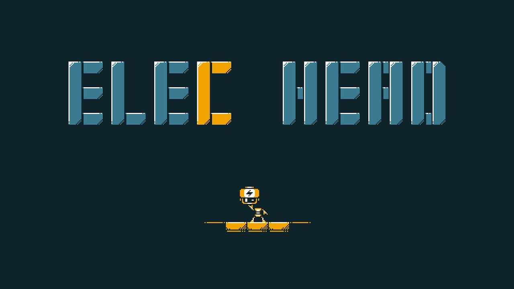
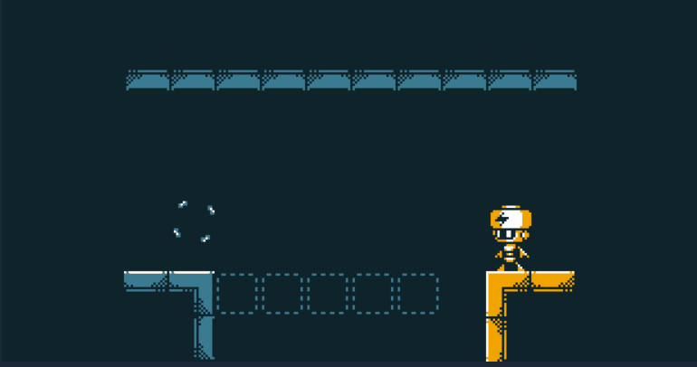
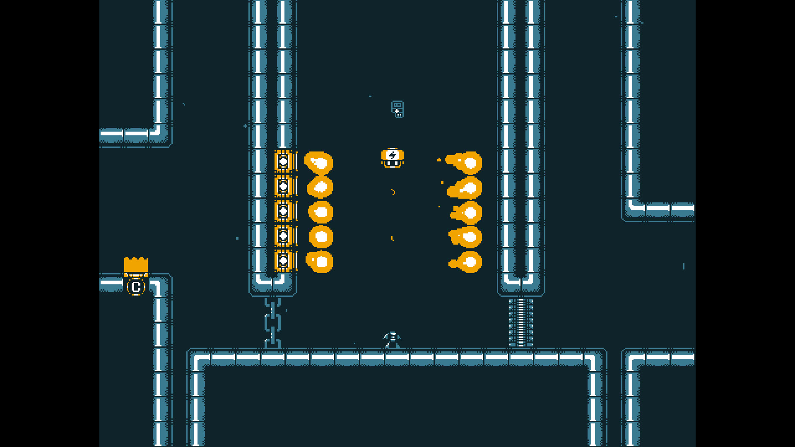

# ElecHead——解决不可能

# Intro

在这款游戏的 steam 简介上只有三个 emoji: 闪电＋机器人的头＋拼图，虽然抽象但是确实是游戏的概括——站哪哪通电，主角是可以把头丢出去的机器人、这是一个解谜游戏（其实是平台跳跃解谜）。 相信在这时你就能感受到这个游戏的独特气质了。对了，这个游戏其实除了标题和 credit 外都没有字出现（甚至成就介绍是空白的），能用图形表示的就用图形，连本地化都省了，直接支持全语言。

*ElecHead*的游戏机制玩起来超级直观好懂，列举一下基本的一些：

- 主角是有一个电池作为头的小机器人
- 主角可以给其他东西通电（平台、墙、链条等等，一个东西通电了周围也会导电）
- 可以把头丢出去，身体不导电
- “人”“头”分离十秒钟自动爆炸

除此之外，还有各式各样的平台机关相配合，我就不多介绍啦，可以直接去看看它的预告片或者上手试试。本作的关卡设计相当优秀，把机制组合产生的各种可能性都很好挖掘出来了，难度也适中。

那么回到本文的标题，“解决不可能”到底是啥意思？很自然大家都会想到第一层：面对看似不能解的关卡想出巧妙的过关方法。那第二层其实是指，我认为 *ElecHead*很巧妙地解决了平台跳跃+解谜类游戏中常见的设计上的问题，这些问题有这几种：

1. 平台跳跃与解谜元素的冲突
2. 玩法整体性不够，引入很多机制但是关联性不强，不直观
3. 同一场景里会动的机关多得让人脑壳疼
4. 跨屏解谜，一下子不知道关卡全貌，让人没有头绪

GMTK（游戏制作工具箱）这位油管主在“开发之旅”系列里也做了一个平台跳跃解谜游戏，里面的一期反馈视频里其实就多多少少体现了一些常见的问题，链接放在这里：[https://www.bilibili.com/video/BV1ZL4y1M7Sq/](https://www.bilibili.com/video/BV1ZL4y1M7Sq/)

那接下来我来分别简单说说 *ElecHead* 是怎么匠心独运地解决这些问题，最后创造出愉快而令人惊喜的游戏体验的。

# 平台跳跃 VS 解谜

玩过的平台跳跃解谜游戏不少，这个是最普遍的问题——没有解决好平台跳跃和解谜之间产生的冲突。因为绝大多数平台跳跃都会要求操作的精准性，但是解谜游戏基本上你脑子里想出来这关怎么解那几乎没有什么操作性的难度。

这两种不同的特性如果混在一起，时常会导致冲突：有时候你想出了正确的解法但是由于操作不行（比如跳不上去）然后误以为自己思路错了；有时候你没懂解谜怎么解但是凭借平台跳跃上的操作技俩可以顺利过关。结果是设计意图都没生效，游玩体验稀碎。而且，很多时候擅长解谜的人可能不擅长平台跳跃，擅长平台跳跃的不一定擅长解谜，最后两边不讨好。

其实解决方法也很简单。不能兼得？那我选一个侧重不就好了。*ElecHead* 就是这么做的，游戏的篇幅基本都放在解谜上，基本没有关卡会让人因为平台跳跃的问题而卡住，基本也没有关卡能利用平台跳跃技巧偷鸡。说起来简单，但其实这个度的把握至关重要，*ElecHead*做到了。除此之外，开发者也没有忽视跳跃手感之类的东西，土狼时间、生动的动画该少的都没少，整体操作手感还是顺的。

顺便推荐一个 GameJam 的平台跳跃解谜作为参考（[https://pynl.itch.io/threadbound](https://pynl.itch.io/threadbound)），游戏概念很惊艳，但是由于机制本身使得平台跳跃和解谜强绑定了，所以这个问题会更难解决。

# 玩法整体性

之前就说了，*ElecHead* 的游戏玩法相当易懂直观，特别是游戏又通过关卡设计进行暗示性引导，所以在保留了玩家“悟”的快乐同时又很好上手。直观易懂的一个原因就是，本作的游戏机制基本都是基于导电和主角丢头特性的，只要把握好核心的玩法，很多机关怎么用都很容易上手，并没有引入特别违和的玩法。

在玩法直观的基础上，又有一些靠观察或实验能轻易发现的细节设定，大大地提升了游戏的玩法深度。比如平台不同的移动速度、电池头扔出去之后的滞留时间、玩家的高度设定等等，甚至有一些不易发现的小细节提供惊喜（这些细节可能并不会影响主线过关），还有一丢丢的有 meta 感觉的小设定。而且游戏本身几乎没有文字提示全靠“悟”，使得游玩体验相当有趣。

想到之前机核网 BOOOM GameJam 上有个主角是黄油猫的解谜游戏*Cato*，整体制作水平很棒，也开始制作正式版了。在那个 GameJam 版本中，它的机制其实相对 *ElecHead* 这样的来说不是特别直观，如果能更好地解决这个问题，我相信对游戏来说是锦上添花的效果。

# 关卡（场景）呈现方式

在关卡的呈现上，*ElecHead*采用从简的方式，同一个谜题涉及的机关会控制在一个有限的数量上，基本一个屏幕就能完整呈现一关，也不会因为机关太多而让玩家一时间接受太多信息而无所适从。在解谜游戏里，让玩家一眼看清关卡布局和目标还是很关键的，如果呈现的信息太庞杂，就不知道从哪入手，也可能玩着玩着忘了要干啥。

当然，*ElecHead*也有要考虑到跨屏的关卡，但是跨屏所涉及的操作都很简单，重点是你要想到有这个操作就好了，不会给玩家的记忆产生负担。而且这样设计也增加了游戏中靠“悟”的小惊喜。

# 结语

游戏整体体量不大，但是兼具深度和巧妙的引导，机制本身也非常直观，就算平时不玩解谜的人也完全可以来玩！我是全成就完了当天立马写了这篇文章。
