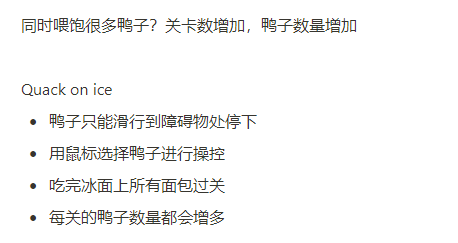
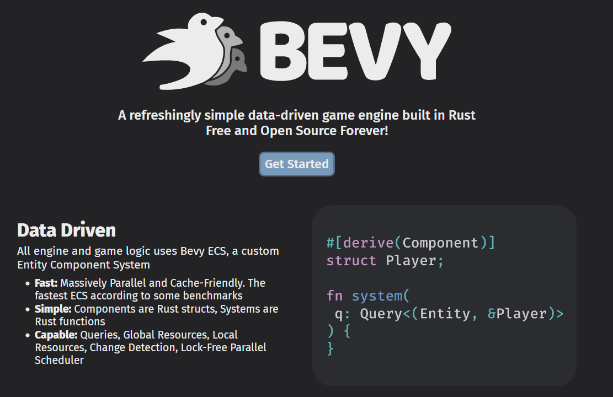
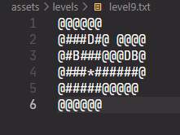
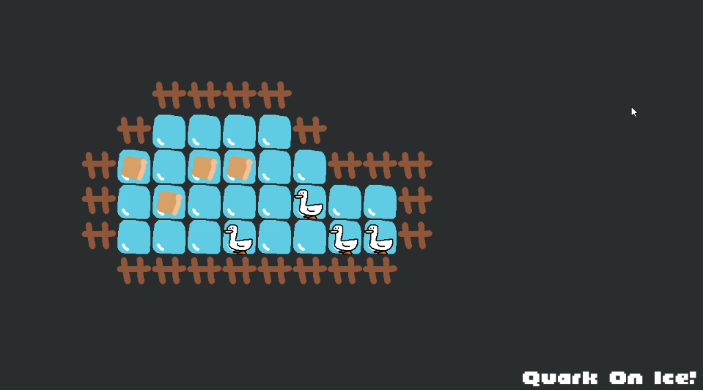
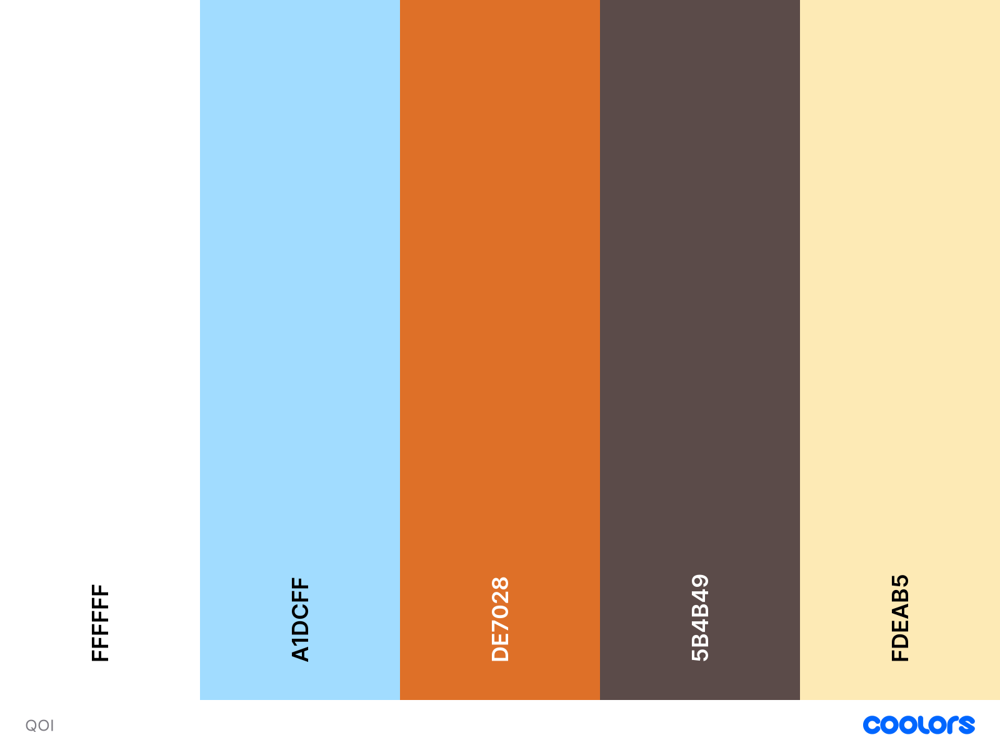
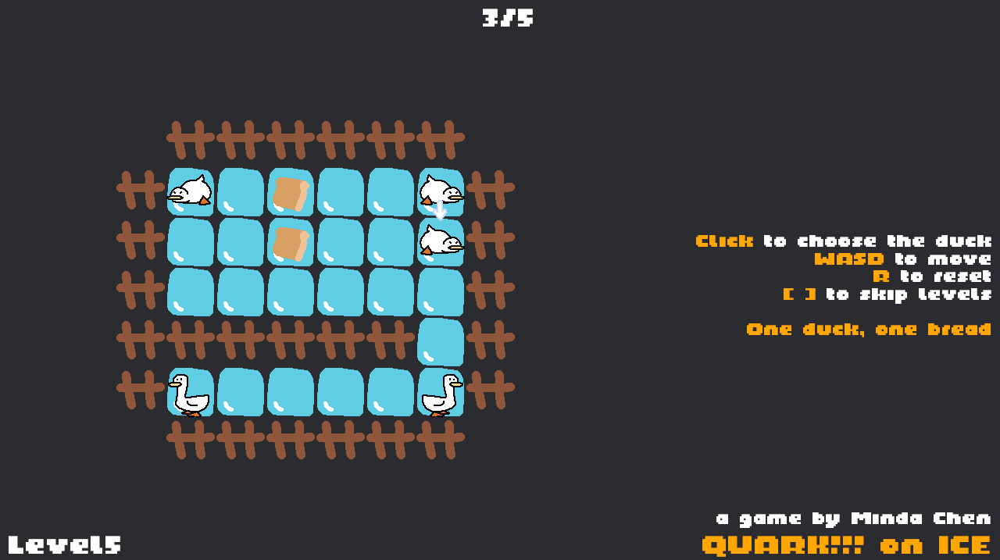
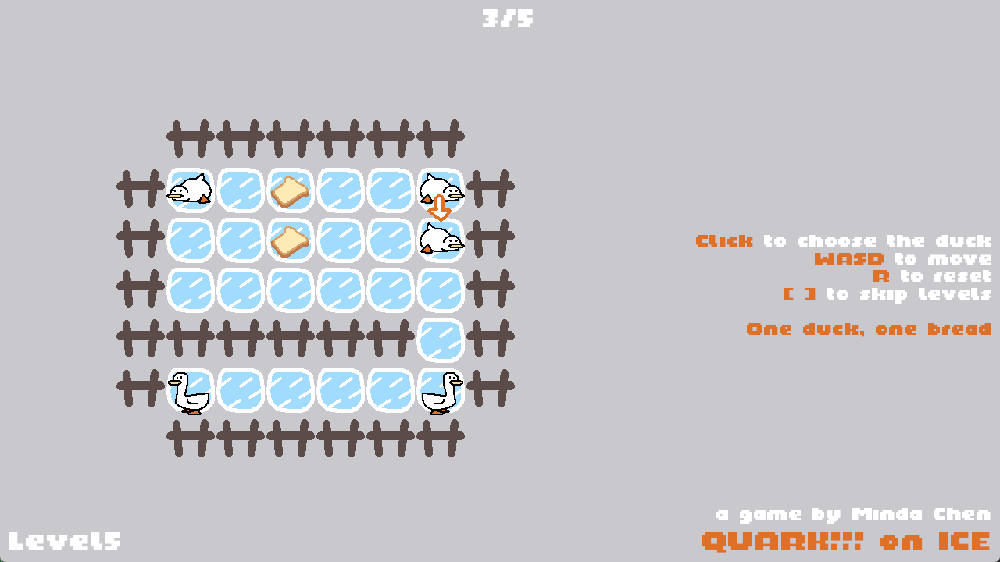
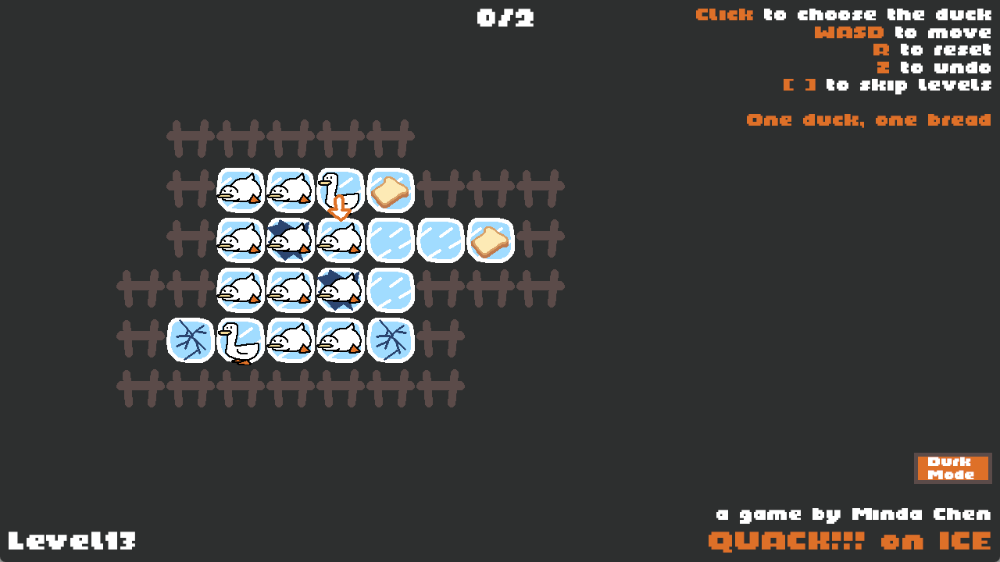
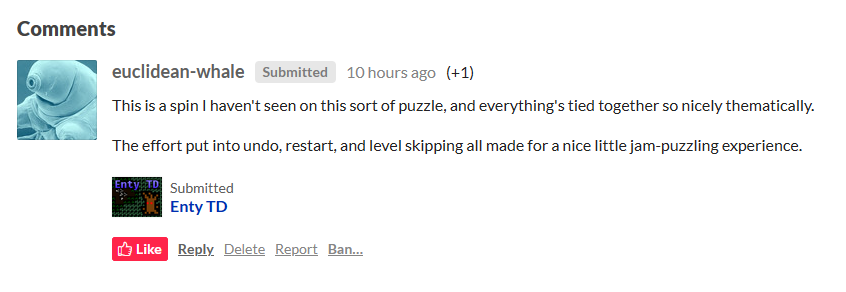

# 从零开始的9天 Bevy Jam 回顾

#### 前言

前不久，我参加了为期 9 天的 Bevy Game Jam 4，活动要求使用 Bevy 游戏引擎开发——到最后，我提交了一款“鸭子滑冰吃面包”主题的解谜游戏。在这次 Game Jam 过程中，我从零开始上手以 Rust 为编程语言的数据驱动游戏引擎 Bevy，单人完成了游戏的所有设计、编程、美术，不得不说是一段非常有趣的体验。因此想简单记录一下，也希望能给想尝试将 Bevy 引擎作为开发工具的游戏开发者一些参考。

- 游戏链接：[《冰上嘎嘎》（QUACK!!! on ICE）](https://akacmd.itch.io/quack-on-ice)

想了解 Bevy 的朋友，可以看一看官网的介绍：[Bevy Engine](https://bevyengine.org/)。我就不多赘述了。

#### 背景

做完个人第一款正式上架的独立游戏[《小石头人踏上旅程》](https://store.steampowered.com/app/2434860/Stonemans_Adventure/)后，我在做游戏这件事上暂时处于停滞状态。一方面是感觉很长时间都没有足够有趣的新点子冒出来，另一方面是对一直使用同一样工具进行游戏开发有点厌倦（说的就是你， Unity）。

经过一段停滞期后，我决定要做点什么东西，不论想法好坏，先试试再说。结果当时正好通过某个游戏开发直播得知 Bevy Jam 4 要开始了，而自己也一直想尝试一下看上去很特殊的开源游戏引擎，且想体验下用 Rust 语言写游戏代码的感受——这样既能强迫自己想新点子，还能上手新工具，是双赢的事情，于是就很愉快地决定参加 Bevy Jam 玩一下。

#### 开发流程

**头脑风暴阶段**

既然已经决定参加 Game Jam，那么说干就干。这次 Bevy Jam 4 的主题是 “That's a LOT of Entities”，我要做的第一件事就是根据此主题构思一个游戏玩法。“Entities”是个比较模糊宽泛的概念，可以指代：玩家操纵的角色、敌人、阻挡物（地形）等等，至于如何表现“多”，可以是某个东西静态数量上的多，也可以让某样东西的数量动态增加。就在这时，我突然想到可以做一款“同时喂饱很多鸭子”的游戏。

好的，现在至少有了初步想法，然后应该会附加解谜玩法。现实生活里的冬天和曾经用面包喂过鸭子的经历，让我想到可以把“冰面滑行”作为游戏的主要机制。于是，我在 Notion 里记录下初步想法草稿，并取了一个看上去挺欢乐的游戏标题：

只在脑子里过一遍，很难想象玩法是否好玩，而如何向这个粗糙的想法填充具体细节（比如鸭子吃面包数量有限定吗？吃完面包还能继续移动吗？），也不太好确定。所以最好能做一个简单的、可以实际上手的模型试一下可行性。我的第一反应是，在用 Bevy 正式开始做游戏前，先用解谜游戏原型工具 PuzzleScript 来尝试一下，毕竟后者实现一个简单的游戏机制几乎不用花什么时间。尝试过后，虽然我在 PuzzleScript 里做的东西没法实现点击选择功能以及一些逻辑上的处理，不过已经能看出游戏设计的部分雏形：比如可以用鸭子卡位的技巧来进行解谜。此时，我对这个想法有了一定信心，觉得是时候开始使用 Bevy 制作游戏了。

**上手 Bevy 游戏引擎**

官网对 Bevy 是这么介绍的：Bevy 游戏引擎是一款令人耳目一新的、简单的数据驱动游戏引擎，用 Rust 语言构建而成，永久免费且开源（A refreshingly simple data-driven game engine built in Rust. Free and Open Source Forever !）！幸运的是，之前一段时间，我正好出于兴趣学习过 Rust，虽然不够熟练，但至少不用花大量时间学习该游戏引擎使用的编程语言。接下来的关键就是理解 Bevy 里的 ECS（实体组件系统），这也是这整个游戏引擎所围绕的思想。官网提供了一个入门指南“The Bevy Book”，我很快就看完了（不是我看得快，是真的很短）。

读过入门指南后，我也只是对整个游戏引擎有最基础的认知，如果要做一款游戏出来，还是无从入手。那么是时候试试实例驱动的学习方式了。除官方提供的很多实现基础功能的实例以外，我找到了 Bevy Jam 3 的第一名作品的开源代码作参考。在想要实现某个功能却没有思路的时候，我就搜索实例，看看别人是怎么实现的。

让开发的每个阶段都有肉眼可见的里程碑会比较有动力，因此，我做的第一件事就是在屏幕上显示一只鸭子，能用方向键移动，且以格子为最小移动单位。此时是 Game Jam 的第二天。

**实现基本功能**

接下来要做的是能够进行关卡/场景的读取。我本来想用如 LDTK 之类的插件来做，后来发现使用的 Bevy 版本太新，但插件没有及时更新，所以用不了。于是想着干脆仿照 PuzzleScript 里面用字符表示关卡的方式，从 .txt 文件读取关卡，编辑关卡也是编辑 .txt 文件。虽然这个方法看上去很原始，也不方便，但面向一款 Game Jam 游戏应该可以一试，实在不行再改进就好。随后我写了一个从 .txt 文件读取关卡再存到数组里去的功能，游戏中的关卡在加载进去之前是被这样表示的，不同的字符代表不同的物体：

这下变成老师傅手打关卡了，不过重要的是能快速实现，所以我对自己的做法还挺满意的。

接下来就是游戏逻辑代码。由于关卡被读到数组中，所以逻辑也都可以在数组里计算，这算是个比较方便的地方。有了之前那些使用经验后，鼠标点击选中鸭子的功能也做得较为顺畅，现在终于有了一个虽然没有什么关卡设计但能玩的场景，鼓掌~

**完善游戏机制**

之前写下的有关游戏机制的想法毕竟只是草稿，现在有能够亲自上手摆弄的场景，便可以把之前悬而未决的一些事情确定下来。鸭子在冰面滑行，只有碰到障碍物才会停下，这是一开始就决定好的，不过玩法方面还有许多模糊的地方。很显然，如果一只鸭子能无限制吃面包，游戏会变得过于简单，多只鸭子的设定也会没有必要，所以一只鸭子应该最多只能吃一块面包。如此一来，鸭子被区分为“饱”和“不饱”两个状态，为了能让鸭子之间互相合作解谜，吃完面包之后应该还是可移动的状态。同时，每关的目标确定为所有面包被吃完。

此处顺便提一句开发后期加入“破冰”机制的事。在 Game Jam 的第七天左右，走在回宿舍的路上，我突然想到可以做一个破冰机制，第二天醒来想了想，如果只有吃饱的鸭子在碎裂冰面上才会破冰将格外有趣，这不仅符合逻辑，也让游戏玩法更有深度（对鸭子的两种状态从特性上做出了区分）。所以我紧急增加了这个破冰机制，它确实带给了我关卡设计方面的新思路，让游戏变得更加有趣了。

**改善美术**

我向来不是很擅长做游戏美术，不过倒是积累了不少偷懒取巧的方法。比如在《小石头人踏上旅程》里用 MagicaVoxel 做体素模型，还有用后处理效果增加画面质感之类的。不过这次，我主要是想到可以在配色方面下功夫，改善之前花几分钟做完的、临时的、简陋的像素美术和游戏界面。身边一些做过设计的朋友，经常会在做界面设计时会先定下主题色，于是我如法炮制，先从鸭子身上选取标志性的颜色，接着确定冰面和面包的颜色，然后凭感觉选了一个看上去舒服的主题色板：

此步完成后，我按选出来的主题颜色用 Aseprite 重新画了一些美术素材，不过，因为严谨的像素美术画起来比较麻烦，而我实际上也不是很会像素画，所以对自己的要求就是类似《Baba Is You》的简单画法就行。改进前后的效果变化还是很可观的，算是用最少的时间成本大大改善了游戏观感。这些工作大约在 Game Jam 的第 7 天左右完成。

顺带一提，较早的一些截图里，我把鸭子叫的拟声词“quack”错误地写成了“quark”（夸克），发现后就改过来了。

**遇到的坑**

Bevy 还是一个处于开发中的、频繁更新的游戏引擎，因此得自己想办法解决各种奇怪问题，有一些问题是我不熟悉新工具导致的，总之踩了一些坑。首先，由于 Bevy 的 API 变化频繁，别人代码里使用的方法在自己这里不一定能用，需要多查文档和官方例子。其次，我在导出到不同平台时也出现了一些问题，比如导出 WASM 版本的时候需要清理代码里用到 std 标准库的地方；比如不能使用 std::fs 里的方法来读取文件，而是要换成用 include_str! 这个宏；成功生成 WASM 游戏版本以后，在网页上还是不能正常运行，查了半天，原来是 Bevy 引擎在 0.12 版本新引入的问题，需要手动禁止使用 .meta 文件才能解决。以前我用 Unity 的时候几乎没有这样的体验（指翻找 Github 上的 issue）。

**完成提交**

技术问题被解决得差不多之后，我开始设计关卡了。由于还没做关卡编辑器，就手动在文本文件里编辑关卡，好在字符串看上去还是相对直观，做关卡的过程也还算顺畅，一共设计了 13 关。不过遗憾的是，因为没有关卡编辑器，所以做不了比较复杂的关卡，整体难度比较简单，但我相信还是保留了一些趣味的。在最后一天，有群友建议加一个“Undo 撤回”功能，之前我觉得太花时间就一直没做（毕竟上一款游戏的撤回共功能做了挺久），后来想了下，其实关卡都存在数组里了，所以应该不难做撤回。最终提交前，我紧急实现了一个撤回的功能，事实证明这是正确的决定。

上传游戏前，我也让认识的朋友试玩了一下。有人反馈一开始的鼠标点击鸭子操作不够直观，他没反应过来要鼠标点击，于是我在第一关额外加了点击提示。破冰操作那里，有人反馈缺少直观的机制引入关卡，于是一个更加直观的引入关被加入到游戏中。除此之外，我在提交前还删除和修改了少数作用不大的关卡。

接下来就是提交和试玩了，Bevy 社区里的伙伴还是挺热心的，留了不少评论和夸奖，我也试玩了一些其它开发者的作品。

**Bevy Jam 4 的全部作品：**[Bevy Jam #4](https://itch.io/jam/bevy-jam-4)

#### 总结

对我来说，这次参加 Bevy Jam 是挺愉快的体验，不仅制作了一款自己觉得比较有趣的游戏，还上手了新工具。使用体验上，Bevy 游戏引擎和我以往用过的游戏引擎很不同：首先，它还没有图形界面，一切基本都在代码里完成，写代码的时候，感觉自己在做完整的游戏，而不是像在 Unity 里东一块西一块写东西和拖拖拽拽（乐）。至于 Bevy 特色的数据驱动的 ECS 实体组件系统，用于开发其实效率挺高，用 Rust 来写游戏开发代码也颇为有趣。不过目前，Bevy 在功能全面性和稳定性方面自然不比成熟的游戏引擎，有些问题得自己想办法搜索、解决。我当时和别人做了一个有点夸张的比喻，用成熟商业游戏引擎做游戏就像用打火机点火，虽然方便但是没成就感，用 Bevy 就像钻木取火。

要问之后是否会继续用 Bevy 做游戏，我的回答大概率是 Yes。尽管做中长线作品可能还是会偏向其他成熟的游戏引擎，但至少，这次用 Bevy 参与 Game Jam 的体验还是不错的，期待 Bevy 之后的更新和进步吧。此外，我在考虑整理下代码，给这款游戏搓一个自己用的关卡编辑器之类的，当然，这都是后话了。

欢迎试玩鸭子游戏 :)
